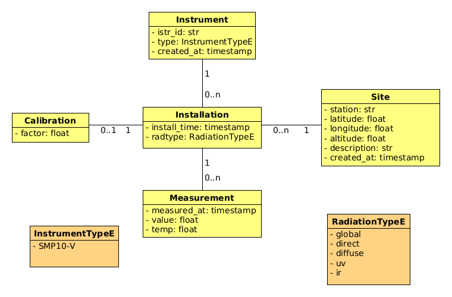

[![Stargazers][stars-shield]][stars-url]

<br />
<div align="center">
  <a href="https://github.com/goa-uva/pyrano">
    
  </a>

<h3 align="center">pyrano</h3>

  <p align="center">
    Lightweight tool for reading solar radiometer data and sending it to a central database, with built-in support for graph generation.
    <br />
    <br />
    <a href="https://goa.uva.es/facultad-de-ciencias/">View Demo</a>
  </p>
</div>


<details>
  <summary>Table of Contents</summary>
  <ol>
    <li>
      <a href="#getting-started">Getting Started</a>
      <ul>
        <li><a href="#prerequisites">Prerequisites</a></li>
        <li><a href="#installation">Installation</a></li>
      </ul>
    </li>
    <li><a href="#usage">Usage</a></li>
    <li>
      <a href="#setting-up-the-database">Setting up the Database</a>
      <ul>
        <li><a href="#db-prerequisites">DB Prerequisites</a></li>
        <li><a href="#1-run-the-sql-scripts">1. Run the SQL scripts</a></li>
      </ul>
    </li>
    <li>
      <a href="#setting-up-a-measurement-station">Setting up a Measurement Station</a>
      <ul>
        <li><a href="#1-set-up-the-configuration-files">1. Set up the configuration files</a></li>
        <li><a href="#2-modify-the-needed-configuration-values">2. Modify the needed configuration values</a></li>
        <li><a href="#3-test-the-instrument-data-download">3. Test the instrument data download</a></li>
        <li><a href="#4-automate-the-read-and-store-task">4. Automate the Read and Store Task</a></li>
        <li><a href="#5-setup-the-sending-of-latest-data">5. Setup the sending of latest data</a></li>
      </ul>
    </li>
    <li>
      <a href="#visualising-data">Visualising Data</a>
      <ul>
        <li><a href="#configuration">Configuration</a></li>
        <li><a href="#available-subcommands">Available Subcommands</a></li>
      </ul>
    </li>
    <li>
      <a href="#visualising-data">Sharing Data with Multiple Networks</a>
      <ul>
        <li><a href="#windy">Windy</a></li>
        <li><a href="#wunderground">Wunderground</a></li>
        <li><a href="#pwsweather">PWSweather</a></li>
        <li><a href="#weathercloud">Weathercloud</a></li>
        <li><a href="#meteoclimatic">Meteoclimatic</a></li>
      </ul>
    </li>
    <li><a href="#license">License</a></li>
    <li><a href="#authors">Authors</a></li>
  </ol>
</details>


## Getting started

### Prerequisites

* Python >= 3.9.0

### Installation

Set Up the Virtual Environment and Install the `pyrano` package and its dependencies.

#### 1. Create and Activate a Virtual Environment

##### **On Linux and macOS**
```sh
python3 -m venv .venv
source .venv/bin/activate
```

##### **On Windows**
```bat
python -m venv .venv
.venv\Scripts\activate
```

#### 2. Install `pyrano` package
After activating the virtual environment, install the `pyrano` package:
```sh
pip install -e .
```
> *Note*: This library depends on GOA's `goadb` python library


## Setting up a Measurement Station

### 1. Initialise the client configuration file

Copy the `config.test.yml` as `config.yml` and fill the adequate values for your installation and station.

### 2. Run the client

Once installed, you can run `send_client.py` script which will invoke the code under `client`,
automatically reading the data and sending it to the database server specified in the configuration file.

This should be automatised using either Linux's crontab or Windows' task scheduler.

## Setting up the Database

### DB Prerequisites

* mySQL or a compatible DB manager like mariaDB

### 1. Run the SQL scripts

After creating the user `username` with the valid permissions for the `pyrano` database, run:
```sh
mysql -u username <db/pyrano.sql -p
mysql -u username <db/start.sql -p
```

### DB Structure

The DB follows the design described in the following diagram:



## Setting up the Database Server

It's not mandatory to set up both the database server and the database together,
although that's the way it's deployed at GOA.

### DB Server Requirements

* Linux
* pyrano

### 1. Initialise the server configuration file

Copy the `serverconf.test.yml` as `serverconf.yml` and fill the adequate values for your database setup.

### 2. Set up pyrano service

* Copy `utils/pyrano-api.service` to your systems' service folder
* Modify that copied file, writing the correct path of the project in your machine
* Activate the system

## Visualising Data

This tool allows users to generate visual representations of the radiation data stored in the database.

This is done through the `plot_last.py` script and must be done with a valid `serverconf.yml` configuration.

```sh
./plot_last.py station_name
```

## License

This project is currently licensed under copyright, and is not intended for public availability.

## Authors

- Javier Gatón Herguedas - [gaton@goa.uva.es](gaton@goa.uva.es).


[stars-shield]: https://img.shields.io/github/stars/goa-uva/pyrano.svg?style=for-the-badge
[stars-url]: https://github.com/goa-uva/pyrano/stargazers
